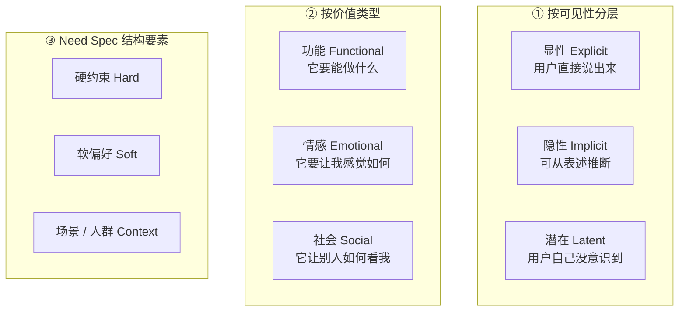
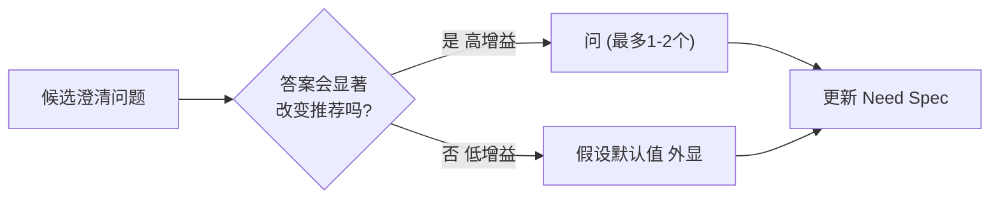
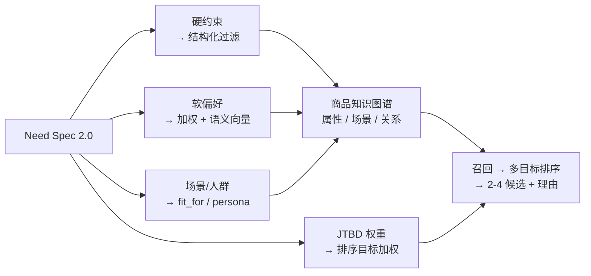
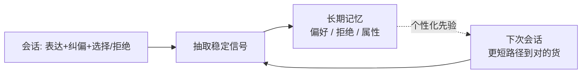

# 12 · 需求端深潜：从「描述品牌」到「描述需求」

> 关联文档：[UX](./03-ux-conversational-commerce.md) · [AI 引擎](./05-ai-engine.md) · [数据模型](./07-data-model.md) · [度量](./11-metrics.md)
> 本文是 Zeno 的**灵魂文档**——把"用户描述需求、AI 找到最适合"这件事拆到可执行的颗粒度。它在 [05 §1](./05-ai-engine.md) 之上做深潜。

---

**📐 需求漏斗：从模糊需求收窄到决定（本文方法论一图速览）**


---

## 1. 为什么需求端是 Zeno 的灵魂

供给侧（CPS、0 佣金）任何有钱有资源的团队都能复制；**真正难、且决定生死的，是"把一句模糊的人话，变成一个被满足且不后悔的购买决定"**。这正是货架电商结构上做不到、而 Zeno 立身的地方。

货架要求用户**把需求翻译成"品牌 + 关键词"**；Zeno 反过来——用户只管说"我要解决什么问题"，翻译、检索、权衡、解释全部由 AI 接管。需求端做得多深，决定了 Zeno 是"又一个搜索框"还是"一个真正懂行的买手"。

---

## 2. 需求的解剖学（Anatomy of a Need）

一个需求不是一句关键词，而是一个**多层、多维**的结构。Zeno 必须同时建模三组维度：



### 2.1 三层（可见性）
- **显性需求**：用户说出来的（"预算 1000 以内""要降噪"）。最容易，但远不够。
- **隐性需求**：藏在表述里、可推断的（"戴久了耳朵疼"→ 非入耳/轻量/夹持力小）。**这是 AI 相对关键词搜索的最大增量。**
- **潜在需求**：用户自己都没意识到的（买跑鞋的新手没想到"还需要考虑足弓类型"）。AI 可在合适时机点醒，但要克制——见 §4.5。

### 2.2 三类价值（JTBD：Jobs To Be Done）
用户"雇佣"一个商品来完成三类工作，缺一不可：
- **功能性**：续航 ≥2 天、能放进通勤包。
- **情感性**：用着安心、不怕踩坑、有掌控感。
- **社会性**：送礼有面子、符合身份、不"露怯"。

> 例：「给爸妈买个血压计」的功能工作是"测得准"，情感工作是"我尽了孝心、他们用着不慌"，社会工作几乎没有 → 推荐应偏向**易用 + 可靠 + 售后好**，而非参数最强。**同一句话，价值权重不同，最优解就不同。**

### 2.3 结构要素（喂给引擎的形态）
硬约束 / 软偏好 / 场景人群 —— 详见 §5 的 Need Spec 2.0。

---

## 3. Zeno 接管了哪 4 件认知苦力

货架把四件认知劳动外包给了用户。Zeno 的产品价值，就是逐一接管它们：

| # | 货架强加给用户的苦力 | Zeno 如何接管 | 对应模块 |
|---|----------------------|----------------|----------|
| 1 | **翻译**：把需求译成关键词/品牌 | 直接理解自然语言需求 + 隐性推断 | §4 §6 / [05 §1](./05-ai-engine.md) |
| 2 | **筛选**：在成千上万结果里过滤 | 跨平台召回 + 多目标排序，收窄到 2–4 个 | [05 §2/§3](./05-ai-engine.md) |
| 3 | **解读**：看懂参数表、辨别真假评论 | 富化成结构化属性 + 口碑提炼（带出处） | [05 §5](./05-ai-engine.md) / [07](./07-data-model.md) |
| 4 | **权衡**：在选项间做取舍 | 坦白取舍、解释"为什么是它"、对比 | [03 §3](./03-ux-conversational-commerce.md) |

> 一句话：**Zeno 卖的不是商品，是"把这四件苦力替你做了"。**

---

## 4. 需求获取（Need Elicitation）：对话如何高效逼近真实需求

目标不是"多问"，而是**用最少的轮次，把需求规格逼近到足以给出可信推荐**。

### 4.1 假设优先（Assume-first），而非追问
能合理推断的，**先假设并外显**，让用户纠正，而不是用问题打断。
> ❌ "你预算多少？要不要降噪？主要什么场景？"（三连问，体验差）
> ✅ "我先按『≤1000、要降噪、通勤用』来挑——不对随时改。"（先给价值，再纠偏）

外显假设把"提问"变成"可否决的默认值"，认知成本从"作答"降到"扫一眼"。

### 4.2 只问高信息增益的问题
当某个缺失约束**会显著改变推荐结果**时，才值得问。用"预期推荐分布的变化（信息增益）"给候选问题排序，每轮最多 1–2 个。



例："给娃买"——是否需要先问年龄？若不同年龄会推完全不同的商品（高增益）→ 问；若该品类对年龄不敏感（低增益）→ 假设并外显。

### 4.3 渐进式收窄（Progressive Narrowing）
不要求用户一次说全。流程是"先给方向 → 看反应 → 再收紧"，让需求在**互动中显形**。用户看到候选后往往才说得清自己要什么（"哦这个太重了"）——这是特征，不是 bug（见 §8 演化）。

### 4.4 永远留逃生口
用户随时可说"别问了，直接给我看"。**澄清是为用户服务的，不是流程关卡。**

### 4.5 潜在需求：点醒但不说教
当用户漏掉了一个会让他后悔的关键维度（潜在需求），AI 可**一句话点醒 + 给默认处理**，但不强迫深入：
> "顺便提醒：跑鞋很看足弓类型，我先按最通用的中性支撑选了，你要是知道自己是内/外翻可以告诉我。"

---

## 5. 需求表示（Need Spec 2.0）

在 [05 §1](./05-ai-engine.md) 的基础上，给每个约束附加**来源、置信度、优先级、弹性**——这让引擎能聪明地权衡和澄清。

```jsonc
{
  "category": "headphones",
  "jtbd": { "functional": 0.6, "emotional": 0.3, "social": 0.1 },
  "constraints": [
    { "key": "price_max", "value": 1000, "type": "hard",
      "source": "stated", "confidence": 1.0, "elastic": false },
    { "key": "form_factor", "op": "!=", "value": "in_ear", "type": "hard",
      "source": "inferred",            // 来自"戴久了耳朵疼"
      "confidence": 0.7, "elastic": true,   // 可在解释后协商
      "evidence": "用户提到久戴不适" },
    { "key": "noise_canceling", "value": 0.8, "type": "soft",
      "priority": 0.9, "source": "stated" },
    { "key": "comfort_long_wear", "value": 0.9, "type": "soft",
      "priority": 0.95, "source": "inferred" }
  ],
  "context": { "use_case": ["commute"], "buyer": "self" },
  "missing_high_gain": ["noise_env"],   // 待澄清且高增益
  "conflicts": []                        // 检测到的相互冲突约束
}
```

**关键字段的价值**
- `source`（stated / inferred / remembered）：推断来的约束应**更谦逊**——展示时说"我猜你…"，并允许一键否决。
- `confidence` + `elastic`：低置信、可弹性的约束，是冲突时优先松绑/优先澄清的对象。
- `priority`：软偏好的相对权重，直接进入排序加权（[05 §3](./05-ai-engine.md)）。
- `conflicts`：显式记录"又要顶级降噪又要超轻又要 500 内"这类矛盾，触发取舍对话（§8.1）。

---

## 6. 隐性需求推断引擎（Implicit Need Inference）

把**语言线索**翻译成**可计算约束**，是需求端最具杠杆的能力。下面是一份可持续扩充的**映射词典**（节选，按品类沉淀到知识图谱）：

| 用户说的（线索） | 推断出的真实约束 | 典型品类 |
|------------------|------------------|----------|
| "久站不累 / 走一天" | 缓震、足弓支撑、轻量、透气 | 鞋 |
| "戴久了耳朵疼" | 非入耳/半开放、轻量、夹持力小 | 耳机 |
| "小户型 / 房子小" | 紧凑尺寸、可折叠收纳、多功能、浅进深 | 家具 / 家电 |
| "经常出差" | 便携、长续航、耐造、登机合规 | 箱包 / 数码 |
| "给爸妈用" | 易用、大字大按键、可靠、售后好、可远程协助 | 数码 / 家电 |
| "敏感肌 / 容易过敏" | 无香精无酒精、低刺激、成分精简、有备案 | 美妆个护 |
| "租的房子" | 免安装、可带走、不破坏墙体、价格友好 | 家居 |
| "新手 / 刚入门" | 易上手、容错高、性价比、不过度堆配置 | 运动 / 数码 / 乐器 |
| "送人 / 送礼" | 品牌感、包装精致、价位得体、保真、可开发票 | 礼品（跨品类） |
| "怕踩坑 / 别翻车" | 高口碑、低退货率、主流款、退货友好 | 通用 |
| "宝宝在用 / 家里有娃" | 安全材质、无小零件、易清洁、静音 | 母婴 / 家电 |

**推断的纪律**
- **可解释**：每条推断都带 `evidence`，展示时坦白"因为你提到 X，我推测 Y"。
- **谦逊**：推断约束默认 `elastic: true` + 中等 `confidence`，易被用户一键纠正。
- **防偏见**：从"给老人用"推"易用"是合理功能推断；但**禁止**基于性别/年龄/地域等做带刻板印象或歧视性的推断。推断只服务"更合适"，不服务"贴标签"（[09](./09-trust-safety-compliance.md)）。

---

## 7. 需求 → 商品 的语义桥（Need-to-Product Bridge）

需求规格不能直接查数据库——它要经**商品知识图谱**翻译成可检索/可排序的信号（[07](./07-data-model.md)）：



- **硬约束** → 结构化 `attributes` 精确过滤（`price ≤ 1000 AND form_factor ≠ in_ear`）。
- **软偏好** → 语义向量匹配 + 加权（按 `priority`）。
- **场景/人群** → 命中商品的 `fit_for.use_cases / personas`（富化产出）。
- **JTBD 权重** → 调整排序的多目标权重（情感工作重 → 加大"口碑/安心"信号）。

> 语义桥的质量上限由**富化质量**决定：商品若没被标好"适合谁/什么场景"，再好的需求理解也匹配不上（[05 §5](./05-ai-engine.md)）。

---

## 8. 难需求处理（Hard Cases）

平庸的需求谁都能接；**Zeno 的护城河在难需求上**。

### 8.1 冲突约束（"又要马儿跑又要马儿不吃草"）
检测到 `conflicts` → 不假装能满足，而是**坦白取舍并让用户排序**：
> "这个价位没法同时要顶级降噪 + 超轻佩戴。你更在意哪个？我可以①保降噪略增重，或②保轻牺牲一档降噪。"

### 8.2 无解兜底（No-solution Fallback）
没有同时满足全部硬约束的商品 → **给最接近的 + 说清差在哪**，并提示可松绑哪个 `elastic` 约束：
> "全网没有同时满足『500 内 + 主动降噪 + 头戴』的。最接近的两个：A 超预算 ¥80 但全满足；B 在预算内但只是被动降噪。"

### 8.3 赠礼：买家 ≠ 使用者
`buyer != user` 时，需求要**围绕使用者建模、围绕买家表达**：推断使用者画像（年龄/关系/场景），同时叠加买家的社会性工作（面子/包装/价位得体）。

### 8.4 探索型 / 极模糊需求（"想给书桌添点啥")
信息极少 → 不强行澄清，而是**给"风格化的几个方向"让用户选**（用选择代替提问）：
> "给你三个方向先感受下：①提升效率（显示器支架/理线）②氛围感（小夜灯/香薰）③健康（护眼灯/坐垫）。点一个我细化。"

### 8.5 专家型硬约束（"给我 16GB+RTX5070+2K 屏 8000 内对比"）
用户已知道要什么 → **跳过澄清，直接进客观对比**，理由要硬核、可溯源、敢讲取舍。别用泛泛话术侮辱专家。

### 8.6 跨品类需求（"搭一个家庭办公区")
一个需求 → 多个品类的**组合解**（桌/椅/显示器/灯/理线），需协调预算分配与风格一致性。知识图谱的 `compatible_with` / 场景聚合在此发挥作用（[07](./07-data-model.md)）。

---

## 9. 需求的演化与长期记忆

### 9.1 会话内演化（Within-session）
用户看到候选后会改主意——这是**收窄过程的正常部分**。每次改约束 → 更新 Need Spec → 实时重排。已展示候选记入 `shown_candidates`，避免重复（[07 §4](./07-data-model.md)）。

### 9.2 跨会话学习（Across-session）
把稳定的偏好、拒绝信号、尺码/肤质等沉淀为**长期记忆**，下次免重复表达（[07 §3](./07-data-model.md)）：



> 记忆**只用于"少走弯路"，不用于操纵**；用户可查/改/删，个性化可一键关闭（[09](./09-trust-safety-compliance.md)）。这是"懂你"与"算计你"的分界线。

---

## 10. 中美需求表达差异

| 维度 | 🇨🇳 中国 | 🇺🇸 美国 |
|------|---------|---------|
| **表达方式** | 场景化、口语化、爱带"求推荐/求避雷" | 偏规格化、目标导向、直说用途与预算 |
| **隐性信号** | "学生党/打工人"含强预算暗示；"618 买不买" | "for my kid""everyday use"含场景暗示 |
| **价值权重** | 性价比、到手价权重高；社会性（面子/送礼）显著 | 评价口碑、退货便利、品牌信任权重高 |
| **信任锚点** | 销量、买家秀、比价 | 评分数量、Verified、退货政策 |
| **澄清容忍度** | 接受多聊几句砍价式互动 | 偏好快、少打扰、直给结论 |

> 推断词典与澄清策略需**按市场本地化**，但"假设优先 + 高增益提问 + 坦白取舍"的核心方法论两市场一致（[03 §7](./03-ux-conversational-commerce.md)）。

---

## 11. 如何衡量"真的懂了需求"

需求理解的好坏必须可度量，直接喂回引擎迭代（呼应 [11](./11-metrics.md)、[05 §7](./05-ai-engine.md)）：

| 指标 | 含义 |
|------|------|
| **需求满足率（Need-Fit Rate）** | 用户认可"这就是我要的"的比例（核心） |
| **隐性推断准确率** | 推断约束被用户确认 vs 否决的比例 |
| **澄清信息增益** | 每个澄清问题平均带来的推荐改善 |
| **纠偏轮次** | 用户需要纠正 AI 假设的次数（越少越准） |
| **冲突识别率** | 矛盾需求被主动识别并坦白的比例 |
| **后悔率（滞后真相）** | 退货/差评/反悔——需求是否被**真正**满足 |

---

## 12. 端到端示例（三种难度）

**① 标准需求**："耳机，1000 内，戴久别夹耳" → 假设外显（降噪/通勤）→ 3 候选 + 理由 → 对比 → 决定。（详见 [03 §8](./03-ux-conversational-commerce.md)）

**② 冲突需求**："500 内，但要顶级降噪 + 超轻" → 识别 conflict → 坦白"这价位二选一" → 用户排序 → 在松绑后的空间里给最优。

**③ 赠礼+模糊**："给我妈挑个生日礼物，预算 500" → buyer≠user，信息少 → 用"方向选择"代替提问（实用/健康/兴趣）→ 锁定方向后按"妈妈+耐用+易用+有面子"建模 → 2 候选 + 为什么适合她 + 包装/开票提示。

---

> **总结**：需求端不是"一个更聪明的搜索框"，而是一套**把人话变成被满足的决定**的方法论——解剖需求、接管认知苦力、最小化澄清、谦逊地推断隐性需求、经知识图谱映射到商品、坦白处理难需求、并在记忆中越来越懂你。这套方法论做多深，Zeno 就有多不可替代。


---

## ⚖️ 正反方辩论（Red Team / Blue Team）

> 对本文关键主张做一次对抗性审视——正方力挺、反方进攻，最后给出裁决与"会改变主意的信号"。

**议题：需求端方法论（假设优先、隐性推断、难需求处理）是真壁垒吗？**

**🟦 正方（支持）**
- 接管认知苦力 + 隐性推断 + 难需求处理，是货架做不到的深度。
- 壁垒在"领域富化数据 + 用户记忆 + 评测闭环"的复利，而非单点提示。

**🟥 反方（质疑）**
- 隐性推断错误率高时反而惹恼用户（"自作聪明"），伤害比帮助大。
- 通用大模型本身就会"理解需求"，Zeno 的方法论未必有专属壁垒，易被通用助手吃掉。
- 难需求是长尾、占比小，投入产出比存疑。

**⚖️ 裁决**
- 推断一律谦逊化（外显 + 易否决），把"自作聪明"风险压到最低。
- 壁垒押在复利资产（富化 / 记忆 / 评测），而非可被复制的 prompt。
- 难需求作为差异化口碑点经营，不作为主要交易量来源。
- **Kill 信号：** 通用助手在选定品类的需求满足率追平 Zeno，证明无专属壁垒。
